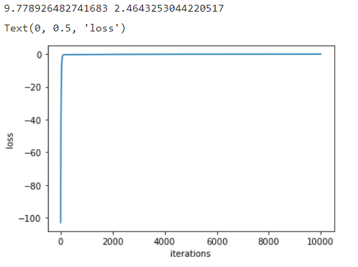
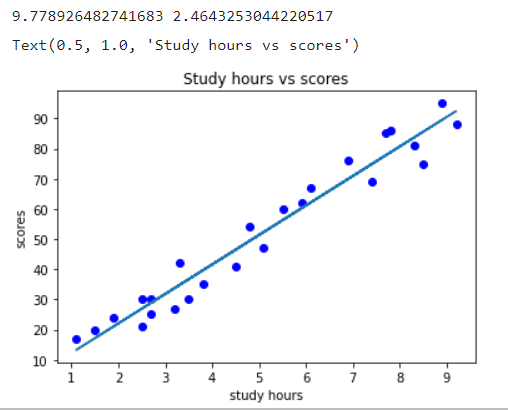

# Implementation-of-Linear-Regression-Using-Gradient-Descent

## AIM:
To write a program to implement the linear regression using gradient descent.

## Equipments Required:
1. Hardware – PCs
2. Anaconda – Python 3.7 Installation / Moodle-Code Runner

## Algorithm
```
1.Use the standard libraries in python for Gradient Design.
2.Upload the dataset and check any null value using .isnull() function.
3.Declare the default values for linear regression.
4.Calculate the loss usinng Mean Square Error.
5.Predict the value of y.
6.Plot the graph respect to hours and scores using scatter plot function. 

```
## Program:
~~~
Program to implement the linear regression using gradient descent.
Developed by: G.Pavithra
RegisterNumber: 212221240036 
import numpy as np
import pandas as pd
import matplotlib.pyplot as plt
data=pd.read_csv("student_scores.csv")
data.head()
data.isnull().sum()
x=data.Hours
x.head()
y=data.Scores
y.head()
n=len(x)
m=0
c=0
l=0.001
loss=[]
for i in range(10000):
    ypred=m*x+c
    mse=(1/n)*sum((ypred-y)*2)
    dm=(2/n)*sum(x*(ypred-y))
    dc=(2/n)*sum(ypred-y)
    c=c-l*dc
    m=m-l*dm
    loss.append(mse)
print(m,c)
y_pred=m*x+c
plt.scatter(x,y,color="blue")
plt.plot(x,y_pred)
plt.xlabel("study hours")
plt.ylabel("scores")
plt.title("Study hours vs scores")
plt.plot(loss)
plt.xlabel("iterations")
plt.ylabel("loss")
~~~
## Output:



## Result:
Thus the program to implement the linear regression using gradient descent is written and verified using python programming.
